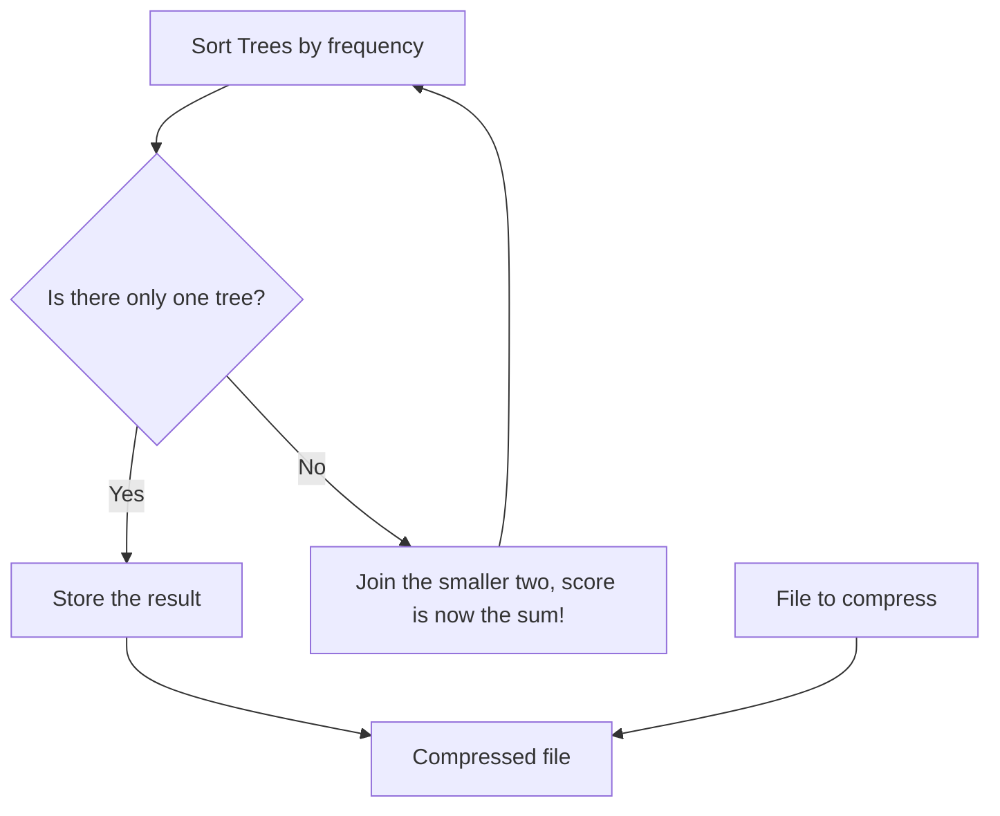

# Huffman-Algorithm

```mermaid
flowchart TD
  A[Sort Trees by frequency] --> B{Is there only one tree?};
  B -- Yes --> C[Store the result];
  B -- No --> D[Join the smaller two, score is now the sum!];
  D --> A;
  C --> E[Compressed file]
  F[File to compress] --> E
```
